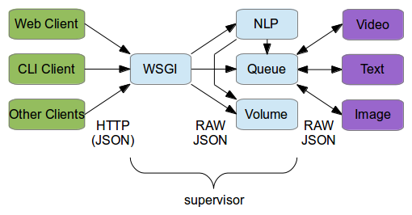

# Musicazoo High-Level Overview

## Block Diagram

Each block represents a process, and each arrow a TCP connection.

Green blocks are Musicazoo *clients*. They connect to Musicazoo's public interface over HTTP. Commands are sent using POST requests and JSON. All requests are initiated by the clients (i.e. are "pull" requests.)

Blue blocks are Musicazoo *services*. They are long-running processes on the server that implement a specific feature, such as volume control. They are managed by supervisor.

Purple blocks are *modules*. They are short-lived processes which implement a playable object on the queue. They are spawned, owned, and controlled by the queue.

## Services

The *WSGI service* handles incoming client connections. It translates and routes their HTTP requests to other services. It also serves a static web interface on /. There is very little intelligence in this service.

The *Volume service* is a very simple service designed to set and retrieve the master volume level. Its raw JSON interface is exposed on the WSGI /vol endpoint.

The *Queue service* handles playable objects called modules. Modules can be added or removed to the queue. The module which is at the top of the queue is *playing*. The rest of the modules are *suspended*. Modules can be added, removed, and reordered. If the queue is empty, a special kind of module called a *background* will play if present. If there are any modules on the queue, the background is suspended. The raw JSON interface to the queue is exposed on the WSGI /queue endpoint.

The *NLP service* ("natural language processing") processes human-readable commands into machine-readable JSON. It talks to the queue and volume modules over their raw JSON endpoints (bypassing the WSGI module.)

## Modules

Modules talk to the queue over two JSON pipes: one for each direction. The pipe that passes messages from the queue to the module is called the *command pipe* because it tells the module what to do. The pipe that passes  messages from the module to the queue is called the *update pipe* because it informs the queue of the module's current state.

